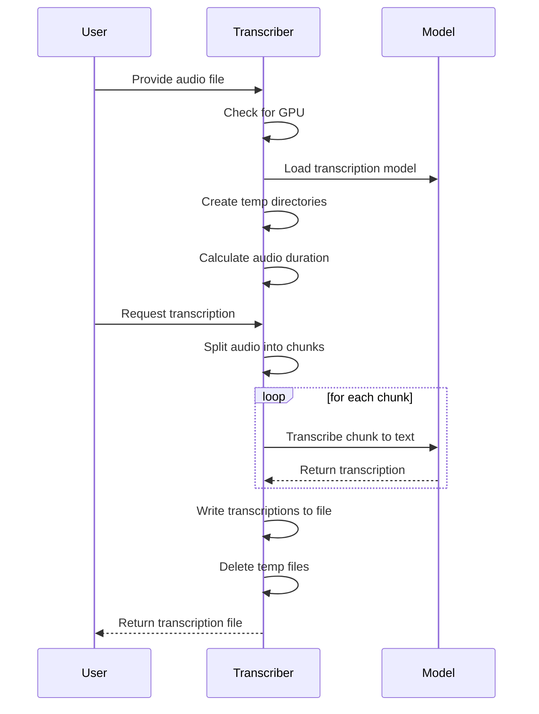

# Transcriber Pal


Transcriber Pal is a Python command-line application that transcribes audio and video files to text using artificial intelligence. It uses the [Whisper](https://github.com/openai/whisper) library for speech recognition and the FFmpeg library for audio and video processing.

## How it works



## Requirements

- Python 3.9 or higher
- FFmpeg
- Torch

You mostly just need to follow the instructions here on the [Whisper Doc](https://github.com/openai/whisper/edit/main/README.md#setup)

You can install the Python dependencies using the following command:

```bash
pip install -r requirements.txt
```

To run Whisper on a GPU, you need to follow these steps:

- Ensure that you have a compatible GPU: Whisper performs best when it has access to a GPU. Check if your system has a compatible GPU, such as an NVIDIA GPU with CUDA support.
- Install the torch package with CUDA support: Whisper relies on the torch package, which offers a CUDA-accelerated version. To install the CUDA-enabled version of torch, run the following commands:

```bash
pip3 uninstall torch
pip cache purge
pip3 install torch torchvision torchaudio --extra-index-url https://download.pytorch.org/whl/cu117
```

## Usage

To transcribe an audio or video file, run the main.py script and pass the path to the input file as a command-line argument:

```bash
python main.py 'path/to/file.mp3'
```

The time it takes to finish the transcript is roughly half the time of the audio, it can be a bit longer if there's a need to convert the video to audio.

The output text will be saved to a file in the output directory with the same name as the input file.

If the input file is a video file, the script will first convert it to an audio file using FFmpeg before transcribing it.

If no input file is provided, the script will display an error message.

## Whisper available models and languages

There are five model sizes, four with English-only versions, offering speed and accuracy tradeoffs. Below are the names of the available models and their approximate memory requirements and relative speed.

|  Size  | Parameters | English-only model | Multilingual model | Required VRAM | Relative speed |
|:------:|:----------:|:------------------:|:------------------:|:-------------:|:--------------:|
|  tiny  |    39 M    |     `tiny.en`      |       `tiny`       |     ~1 GB     |      ~32x      |
|  base  |    74 M    |     `base.en`      |       `base`       |     ~1 GB     |      ~16x      |
| small  |   244 M    |     `small.en`     |      `small`       |     ~2 GB     |      ~6x       |
| medium |   769 M    |    `medium.en`     |      `medium`      |     ~5 GB     |      ~2x       |
| large  |   1550 M   |        N/A         |      `large`       |    ~10 GB     |       1x       |

In case you want to change the model, you can do so by changing the `model` variable in the [audio_to_text](./tools/audio_to_text.py) file.

```python
model = whisper.load_model("base") # Model to use for transcription
```

Keep in mind that the larger the model, the more memory it will require to run and the longer it will take to transcribe the audio, but it will also be more accurate.

## License

This project is licensed under the MIT License. See the LICENSE file for more information.
